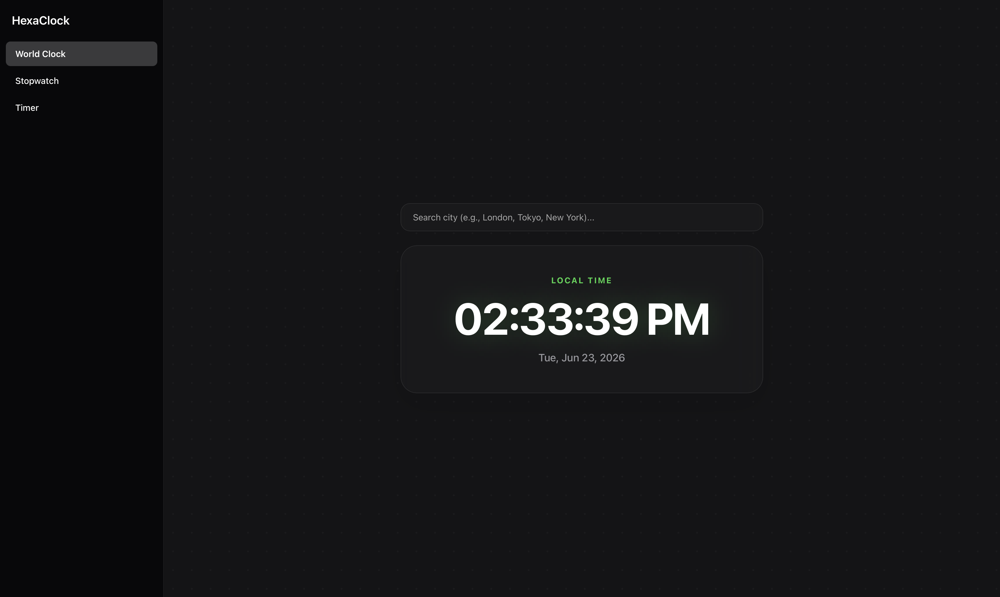

# HexaClock

View HexaClock at: https://hexa-programmer.github.io/HexaClock/
HexaClock is a minimal, premium web application built using HTML, CSS, and JavaScript.
It runs entirely in the browser, featuring a World Clock, Stopwatch, and Timer, operating completely offline without any external APIs.

---

## Features

1) World Clock: Real-time timezone calculations using native browser APIs with a built-in city search.

2) Precision Stopwatch: Millisecond-accurate tracking with start, pause, and reset functionality.

3) Smart Timer: Intuitive countdown timer with a synthesized audio alarm that plays when time is up.

4) Premium UI: Features a glassmorphic design, subtle neon glows, automatic Dark/Light mode, and seamless mobile responsiveness.

---

## How it works

The application utilizes core browser capabilities to function without external dependencies:

- Time calculations: Uses the native `Intl.DateTimeFormat` and `Date()` objects to calculate global timezone offsets locally.
- Loop logic: Relies on vanilla JavaScript `setInterval` loops for reliable stopwatch and timer execution.
- Audio Alarm: Uses the `Web Audio API` (`AudioContext`) to synthesize a digital notification beep entirely from code, requiring no external sound files.

---

## This allows the tool to be incredibly lightweight, secure, and 100% offline-capable.

Tech Stack

- HTML5
- CSS3
- Vanilla JavaScript (no frameworks)

---

## Installation

To run HexaClock locally:

git clone https://github.com/Hexa-Programmer/HexaClock.git
cd HexaClock
open index.html

---

## Note

This is a personal learning project and will continue to evolve over time.

Made with ❤️ by Hexa-Programmer
